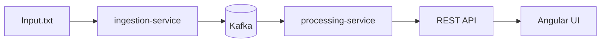
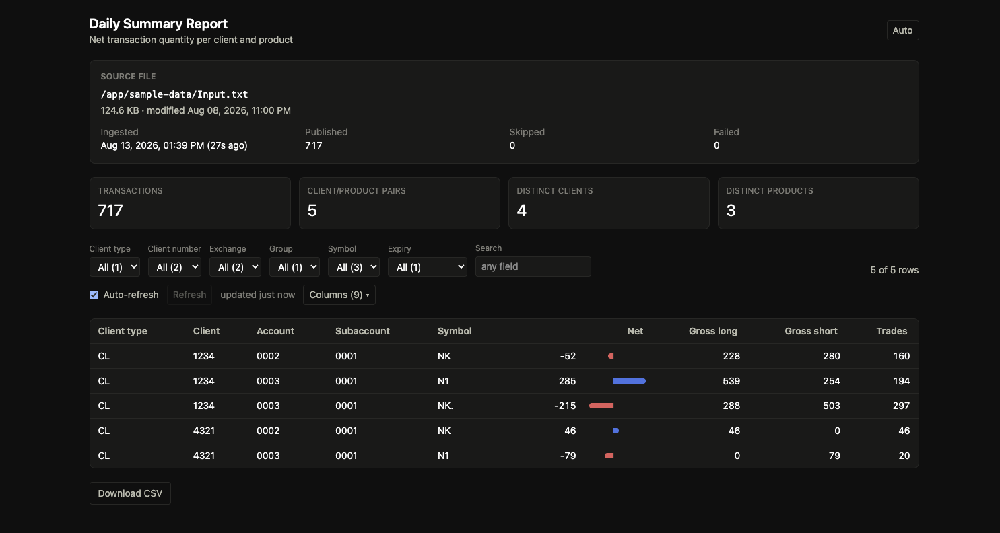

# Processed Future Movement

Daily summary reporting for futures transactions produced by System A.

## Problem

System A emits `Input.txt`, a fixed-width text file where each 176-byte record is
one future transaction for a client. The business needs a daily summary — for each
unique (client, product) pair, the net transaction quantity
(`sum(QUANTITY LONG - QUANTITY SHORT)`) across the day — delivered as `Output.csv`
and via a REST API.

Full field layout: [docs/file-spec.md](docs/file-spec.md).
Requirements source: `Requirements Specification.pdf`, `System A File Specification.pdf`.

## Architecture

This is built as a real-time streaming pipeline rather than a one-shot batch job:



| Module | Responsibility |
|---|---|
| [`common`](common/) | Fixed-width parsing, domain model (`FutureTransaction`, `ReportKey`, `NetPosition`), Kafka message schema — shared by both services so parsing logic exists exactly once |
| [`ingestion-service`](ingestion-service/) | `POST /api/v1/ingest` reads the fixed-width file and publishes one Kafka event per record: JSON value, keyed by `ReportKey`, each carrying a content-derived `transactionId` header. Idempotent per file version |
| [`processing-service`](processing-service/) | Kafka Streams consumer: dedupes on `transactionId`, maintains a running per-(client, product) net-quantity aggregate, exposes it via REST as JSON and CSV |
| [`frontend`](frontend/) | Angular UI: 17 available columns (9 shown by default, choice persisted), six decomposed filter dimensions (client type, client number, exchange, group, symbol, expiry) plus global search, sortable columns, a diverging net-quantity bar, KPI tiles including distinct products, light/dark themes, 5-second auto-refresh with manual fallback. A failed refresh keeps the last good data rather than blanking the table |
| [`k8s`](k8s/) | Kubernetes manifests for the whole stack in a `pfm` namespace, plus Dockerfiles for all three application images |

The detailed diagram, the message key, dedup and the state stores are in
[docs/architecture.md](docs/architecture.md).

## Quick start

One command builds the images, starts the stack, publishes the sample data, and prints
the report (the first run takes a few minutes while three images build):

```bash
./scripts/run.sh
```

To ingest your own fixed-width file instead, pass it as an argument — from anywhere on
disk, it does not need to be inside the repo:

```bash
./scripts/run.sh path/to/your-file.txt
```

The script tears down any previous run first, waits for both services to become ready,
waits for the aggregation to converge rather than guessing at a sleep, and — for the
sample input — verifies the output matches `sample-output/Output.csv`. Bad lines are
reported with their line number and reason rather than stopping the run. Pass `--help`
for details.

Once it finishes, the UI is at **http://localhost:8080**:



Stop everything, including volumes:

```bash
docker compose down -v
```

### Running it manually

The script is a convenience wrapper, not a requirement. The same thing by hand:

```bash
docker compose up -d --build
```

```bash
curl -X POST http://localhost:8081/api/v1/ingest
```

To run the services on the host via Maven and containerize only the broker — the loop the
per-module READMEs describe:

```bash
docker compose up -d kafka
```

For the Kubernetes path instead, see [k8s/README.md](k8s/README.md).

### What happens on a cold start

Cold start is ordered, and the ordering matters:

1. **Kafka** comes up and passes its healthcheck.
2. **ingestion-service** starts and creates the `future-transactions` topic (3 partitions)
   via its `NewTopic` bean.
3. **wait-for-topic** — a one-shot container — polls until the topic actually exists,
   then exits 0.
4. **processing-service** starts, validates its Kafka Streams topology against the now-existing
   topic, and reaches `RUNNING`.

Seeing `pfm-wait-for-topic` as `Exited (0)` in `docker compose ps -a` is therefore
expected, not a failure. It is a one-shot container, so it will not appear in plain
`docker compose ps` at all.

The wait loop has no timeout. If `docker compose up` seems to hang and `processing-service`
never reports healthy, check whether it is still polling or Kafka never came up:

```bash
docker compose logs wait-for-topic
```

Why the gate exists rather than an application-code retry:
[design notes](docs/design-notes.md#why-the-startup-gate-exists).

### Using your own file

`./sample-data` is bind-mounted read-only into `ingestion-service` at `/app/sample-data`,
so you can drop in your own `Input.txt` and re-ingest with no rebuild.

`./scripts/run.sh path/to/your-file.txt` does this for you — it copies the file into the
mount and tears down first, so the caveat below is already handled. The rest of this
section matters when swapping files by hand.

> [!IMPORTANT]
> **The report is a running aggregate, not a snapshot of the last file ingested.**
>
> A different file produces different content-derived `transactionId`s. The dedup store
> has never seen them, so every record is treated as new and **adds to the existing
> totals** rather than replacing them. The numbers will look wrong if you are expecting
> the second file's figures on their own.
>
> Run `docker compose down -v` before ingesting a different file. That discards the Kafka
> volumes and the Streams state stores, giving you a clean aggregate.
>
> Why this is designed behaviour, and not a bug:
> [design notes](docs/design-notes.md#why-re-ingesting-a-different-file-adds-to-the-totals).

### Generated test fixtures

`scripts/gen-test-data.py` writes fixtures into `sample-data/generated/`
(gitignored) by patching fixed-width slices of real sample records, so generated
records are layout-correct by construction.

```bash
python3 scripts/gen-test-data.py
```

| File | Lines | What it exercises |
|---|---|---|
| `large-7000.txt` | 7000 | Volume, and every filter dropdown with several options |
| `mixed-errors.txt` | 200 | Five corrupted lines — partial success |
| `truncated-line.txt` | 50 | A line shorter than 176 bytes |
| `bad-quantity.txt` | 50 | A non-numeric quantity field |
| `bad-date.txt` | 50 | An impossible expiration date (`20101332`) |
| `blank-lines.txt` | 52 | Blank and whitespace-only lines |
| `all-invalid.txt` | 10 | Nothing parseable — `published: 0`, empty report, no crash |
| `empty.txt` | 0 | A zero-length file |

Point the ingestion service at one with `PFM_INPUT_FILE` — a **container** path,
since `sample-data/` is mounted at `/app/sample-data`:

```bash
docker compose down -v
PFM_INPUT_FILE=/app/sample-data/generated/large-7000.txt docker compose up -d
curl -X POST localhost:8081/api/v1/ingest
```

`docker compose down -v` is not optional. The report is a running aggregate, so
ingesting a different file without wiping the state stores adds to the existing
totals rather than replacing them, and the numbers will look wrong.

For the missing-file path (HTTP 404), point `PFM_INPUT_FILE` at any path that
does not exist.

> [!NOTE]
> `PFM_INPUT_FILE` is the Compose-only knob. The service's own variable is
> `INGESTION_FILE_PATH`, which [`ingestion-service`](ingestion-service/README.md)
> asks you to set to a *host* path for the Maven dev loop. They are kept separate
> so an exported dev-loop value cannot leak into the container, where that path
> would not exist.

## Assumptions

| Assumption | Basis |
|---|---|
| **`D` = debit = negative** on the three money fields | All 717 sample records carry `D` at positions 86, 102 and 118. There is no `C` example anywhere in the sample, so the accounting convention is *assumed*, not verified from data |
| **Quantity signs**: blank or `+` is positive, `-` negates | Standard fixed-width convention; consistent with the sample |
| **Records are 176 bytes** with trailing `FILLER` stripped | The spec says 303 bytes; the sample file has the 127-byte trailing `FILLER` stripped. See [docs/file-spec.md](docs/file-spec.md) |
| **`sample-output/Output.csv` is reference truth** for the sample input | Pinned by `FullPipelineGoldenTest` and `FixtureDriftTest` |
| **A single ingestion source** | See [Scalability](docs/design-notes.md#scalability) for the single-instance constraints this implies |

The `D` = debit assumption in depth:
[design notes](docs/design-notes.md#assumptions-in-depth).

## API endpoints

| Method | Path | Service | Port | Returns | Notable statuses |
|---|---|---|---|---|---|
| `POST` | `/api/v1/ingest` | ingestion | 8081 | `IngestionResult` — records parsed and published | `404` file not found · `502` Kafka publish failed |
| `POST` | `/api/v1/ingest?force=true` | ingestion | 8081 | Same, bypassing the per-file-version idempotency check | as above |
| `GET` | `/api/v1/ingest/status` | ingestion | 8081 | `IngestionStatus` — configured path, file metadata, last run | — |
| `GET` | `/api/v1/report` | processing | 8082 | `ReportEntry[]` — the full daily summary as JSON | `503` store not ready |
| `GET` | `/api/v1/report/csv` | processing | 8082 | `Output.csv` as `text/csv` | `503` store not ready |

Through the frontend's nginx, all of these are also reachable on port **8080** under the
same paths.

`GET /api/v1/report/csv` sets `Content-Disposition: attachment; filename="Output.csv"`,
so browsers download it as a file with the required name rather than rendering it inline.

Why the API returns `503` rather than an empty `200`:
[design notes](docs/design-notes.md#why-503-and-not-an-empty-200). Why the CSV and JSON
payloads differ: [design notes](docs/design-notes.md#csv-vs-json-a-deliberate-divergence).

## Requirements traceability

| Requirement | Where it is met |
|---|---|
| `Client_Information` = CLIENT TYPE + CLIENT NUMBER + ACCOUNT NUMBER + SUBACCOUNT NUMBER | [`ReportKey.clientInformation()`](common/src/main/java/com/pfm/common/domain/ReportKey.java) |
| `Product_Information` = EXCHANGE CODE + PRODUCT GROUP CODE + SYMBOL + EXPIRATION DATE | [`ReportKey.productInformation()`](common/src/main/java/com/pfm/common/domain/ReportKey.java) |
| Net quantity = `sum(QUANTITY LONG − QUANTITY SHORT)` per (client, product) | [`AggregationTopology`](processing-service/src/main/java/com/pfm/processing/streams/AggregationTopology.java) → [`NetPosition.plus()`](common/src/main/java/com/pfm/common/domain/NetPosition.java) |
| `Output.csv` with the three required columns | [`ReportController.reportCsv()`](processing-service/src/main/java/com/pfm/processing/report/ReportController.java) · reference copy at [`sample-output/Output.csv`](sample-output/Output.csv) |
| REST API exposing the summary | [`ReportController`](processing-service/src/main/java/com/pfm/processing/report/ReportController.java) — `GET /api/v1/report` |
| Fixed-width record parsing per the file spec | [`common`](common/) · layout in [docs/file-spec.md](docs/file-spec.md) |

[`sample-output/Output.csv`](sample-output/Output.csv) is computed directly from
[`sample-data/Input.txt`](sample-data/Input.txt) (the provided 717-record sample), so the
expected result is visible without running anything.

## Testing

```bash
mvn verify
```

```bash
npm test --prefix frontend
```

The strongest correctness signal in the repo is
[`FullPipelineGoldenTest`](processing-service/src/test/java/com/pfm/processing/FullPipelineGoldenTest.java).
It stands up a real Kafka broker with Testcontainers, runs **both** real Spring services
against it, drives `POST /api/v1/ingest` over the full 717-record sample, asserts all 717
records were published, and then asserts that the CSV the API returns is **byte-identical**
to `sample-output/Output.csv`. That exercises parsing, keying, serialization, the Kafka
round-trip, dedup, aggregation and CSV rendering in one assertion, against the reference
output — not against the pipeline's own idea of what it should produce.

[`FixtureDriftTest`](processing-service/src/test/java/com/pfm/processing/FixtureDriftTest.java)
guards the fixtures themselves, failing if either classpath copy drifts from the shipped
`sample-output/Output.csv` or `sample-data/Input.txt`.

Beyond that: `kafka-streams-test-utils` topology tests cover dedup and aggregation without a
broker, per-module end-to-end tests cover each service in isolation, and Vitest covers the
frontend's components and stores.

## Tech stack

| Layer | Choice |
|---|---|
| Language | Java 21 |
| Framework | Spring Boot 3.5.4 |
| Streaming | Apache Kafka 3.9 — Streams **Processor API** for dedup, **Interactive Queries** for the report |
| Build | Maven multi-module (`common`, `ingestion-service`, `processing-service`) |
| Frontend | Angular 21.2 (signals, standalone components, no component library), Tailwind CSS 4.3, TypeScript 5.9 |
| Serving | nginx — serves the built SPA and reverse-proxies `/api` |
| Local orchestration | Docker Compose |
| Deployment | Kubernetes manifests, tested on kind |
| Testing | JUnit 5, Testcontainers, `kafka-streams-test-utils`, Vitest |
| CI | GitHub Actions |

## Known limitations

| Limitation | Detail |
|---|---|
| **No authentication** | Every endpoint is open. There is no authn or authz anywhere in the stack |
| **Kafka data is ephemeral** | The k8s manifests use `emptyDir`; there are no persistent volumes. A broker restart loses the topic and all state |
| **Containers run as root** | No `securityContext`, no non-root user in the Dockerfiles |
| **No resource limits** | No CPU or memory requests/limits on any k8s workload |
| **Unbounded dedup store** | `seen-transaction-ids` has no TTL, so it grows without limit across ingests |
| **In-memory ingestion status** | Last-run status is held in the process and is lost on restart |
| **Single-instance processing** | `processing-service` cannot be scaled out without a cross-instance query strategy — see [design notes](docs/design-notes.md#scalability) |

## Further reading

| Doc | What it covers |
|---|---|
| [Architecture](docs/architecture.md) | The detailed diagram, the message key, dedup, the state stores, startup ordering |
| [Design notes](docs/design-notes.md) | Why it is built this way — rationale, assumptions in depth, scalability, and the nine per-slice design docs |
| [File spec](docs/file-spec.md) | The fixed-width record layout |
| [CLAUDE.md](CLAUDE.md) | Operational context for working on the repo: build gotchas, load-bearing invariants, and the assumptions baked into the code |

Per-module detail: [`common`](common/) · [`ingestion-service`](ingestion-service/) ·
[`processing-service`](processing-service/) · [`frontend`](frontend/) ·
[`k8s`](k8s/README.md)
