# Processed Future Movement

Daily summary reporting for futures transactions produced by System A.

## Problem

System A emits `Input.txt`, a fixed-width text file where each 176-byte record is
one future transaction for a client. The business needs a daily summary — for each
unique (client, product) pair, the net transaction quantity
(`sum(QUANTITY LONG - QUANTITY SHORT)`) across the day — delivered as `Output.csv`
and via a REST API.

Full field layout: [docs/file-spec.md](docs/file-spec.md).
Requirements source: `Requirements Specification.pdf`, `System A File Specification.pdf`.

## Architecture

This is built as a real-time streaming pipeline rather than a one-shot batch job:

```
Input.txt --> ingestion-service --> Kafka topic --> processing-service --> REST API --> frontend
                                                          (Kafka Streams          (Angular)
                                                           aggregation)
```

In detail:

```mermaid
flowchart TB
    FILE["<b>sample-data/Input.txt</b><br/>717 fixed-width records, 176 bytes each"]

    subgraph ING["ingestion-service :8081"]
        PARSE["FixedWidthParser<br/><i>common module</i>"]
        PROD["KafkaProducer<br/>acks=all, enable.idempotence=true"]
    end

    subgraph KAFKA["Kafka :9092"]
        TOPIC["<b>future-transactions</b> — 3 partitions<br/><br/><b>key</b> ReportKey.encode&#40;&#41;<br/>clientType &#124; clientNumber &#124; accountNumber &#124; subaccountNumber<br/>&#124; exchangeCode &#124; productGroupCode &#124; symbol &#124; expirationDate<br/><br/><b>header</b> transactionId = sha256&#40;fileHash + ':' + lineNumber&#41;<br/><b>value</b> FutureTransaction &#40;JSON&#41;"]
    end

    subgraph PROC["processing-service :8082"]
        DEDUP["DedupProcessor<br/><i>Processor API</i>"]
        SEEN[("<b>seen-transaction-ids</b><br/>persistent KV, changelog-backed")]
        AGG["groupByKey → aggregate<br/>netQuantity += long − short"]
        NET[("<b>net-quantity-store</b><br/>persistent KV, changelog-backed")]
        API["ReportController<br/><i>Interactive Queries</i>"]
    end

    NGINX["nginx :8080<br/>serves the SPA, proxies /api"]
    UI["Angular frontend"]

    FILE --> PARSE --> PROD --> TOPIC
    TOPIC --> DEDUP
    DEDUP <-.->|"seen before?"| SEEN
    DEDUP -->|"new ids only"| AGG
    AGG <-.-> NET
    NET --> API --> NGINX --> UI
```



Two details in that diagram carry most of the design:

**The message key is the eight-field `ReportKey`, not the two report columns.**
`Client_Information` and `Product_Information` are *derived* from those eight fields
rather than stored, because the parser trims each field before concatenating —
which makes the sub-field boundaries variable-width and impossible to recover from
the joined string. Keying on the full `ReportKey` means every record for a given
(client, product) pair lands on the same partition, so aggregation is partition-local
with no repartition step.

**The `transactionId` header is content-derived**, `sha256(fileContentHash + ":" + lineNumber)`,
so re-ingesting the same file produces the same ids, `DedupProcessor` recognises them
in `seen-transaction-ids`, and the totals do not double. This is what makes ingestion
safely repeatable — and it is also what makes a *different* file add to the totals
rather than replace them (see the [caveat](#using-your-own-file) below).

| Module | Responsibility |
|---|---|
| [`common`](common/) | Fixed-width parsing, domain model (`FutureTransaction`, `ReportKey`, `NetPosition`), Kafka message schema — shared by both services so parsing logic exists exactly once |
| [`ingestion-service`](ingestion-service/) | `POST /api/v1/ingest` reads the fixed-width file and publishes one Kafka event per record: JSON value, keyed by `ReportKey`, each carrying a content-derived `transactionId` header. Idempotent per file version |
| [`processing-service`](processing-service/) | Kafka Streams consumer: dedupes on `transactionId`, maintains a running per-(client, product) net-quantity aggregate, exposes it via REST as JSON and CSV |
| [`frontend`](frontend/) | Angular UI: 17 available columns (8 shown by default, choice persisted), client / account / product filters plus global search, sortable columns, a diverging net-quantity bar, per-currency fee KPIs, light/dark themes, 5-second auto-refresh with manual fallback. A failed refresh keeps the last good data rather than blanking the table |
| [`k8s`](k8s/) | Kubernetes manifests for the whole stack in a `pfm` namespace, plus Dockerfiles for all three application images |

## Requirements traceability

| Requirement | Where it is met |
|---|---|
| `Client_Information` = CLIENT TYPE + CLIENT NUMBER + ACCOUNT NUMBER + SUBACCOUNT NUMBER | [`ReportKey.clientInformation()`](common/src/main/java/com/pfm/common/domain/ReportKey.java) |
| `Product_Information` = EXCHANGE CODE + PRODUCT GROUP CODE + SYMBOL + EXPIRATION DATE | [`ReportKey.productInformation()`](common/src/main/java/com/pfm/common/domain/ReportKey.java) |
| Net quantity = `sum(QUANTITY LONG − QUANTITY SHORT)` per (client, product) | [`AggregationTopology`](processing-service/src/main/java/com/pfm/processing/streams/AggregationTopology.java) → [`NetPosition.plus()`](common/src/main/java/com/pfm/common/domain/NetPosition.java) |
| `Output.csv` with the three required columns | [`ReportController.reportCsv()`](processing-service/src/main/java/com/pfm/processing/report/ReportController.java) · reference copy at [`sample-output/Output.csv`](sample-output/Output.csv) |
| REST API exposing the summary | [`ReportController`](processing-service/src/main/java/com/pfm/processing/report/ReportController.java) — `GET /api/v1/report` |
| Fixed-width record parsing per the file spec | [`common`](common/) · layout in [docs/file-spec.md](docs/file-spec.md) |

[`sample-output/Output.csv`](sample-output/Output.csv) is computed directly from
[`sample-data/Input.txt`](sample-data/Input.txt) (the provided 717-record sample), so the
expected result is visible without running anything.

## Application startup

Cold start is ordered, and the ordering matters:

1. **Kafka** comes up and passes its healthcheck.
2. **ingestion-service** starts and creates the `future-transactions` topic (3 partitions)
   via its `NewTopic` bean.
3. **wait-for-topic** — a one-shot container — polls until the topic actually exists,
   then exits 0.
4. **processing-service** starts, validates its Kafka Streams topology against the now-existing
   topic, and reaches `RUNNING`.

**Why the gate exists.** Kafka Streams validates its topology at startup. If the source
topic does not exist yet, it throws a fatal `MissingSourceTopicException` that kills the
`StreamThread` — and the thread does not recover on its own. The application process
stays up while serving nothing, which is worse than crashing. Gating the start on the
topic's existence removes the race entirely, without an application-code retry loop that
would only paper over it. In Kubernetes the same gate is an `initContainer` on the
`processing-service` pod (`k8s/processing-service.yaml`).

Seeing `pfm-wait-for-topic` as `Exited (0)` in `docker compose ps -a` is therefore
expected, not a failure. It is a one-shot container, so it will not appear in plain
`docker compose ps` at all.

The wait loop has no timeout. If `docker compose up` seems to hang and `processing-service`
never reports healthy, check whether it is still polling or Kafka never came up:

```bash
docker compose logs wait-for-topic
```

## How to use the application

Bring up the whole stack (the first run builds three images, so it takes a few minutes):

```bash
docker compose up -d --build
```

Publish the sample data:

```bash
curl -X POST http://localhost:8081/api/v1/ingest
```

Open the UI at **http://localhost:8080**.

Tear down, including volumes:

```bash
docker compose down -v
```

To run the services on the host via Maven and containerize only the broker — the loop the
per-module READMEs describe:

```bash
docker compose up -d kafka
```

For the Kubernetes path instead, see [k8s/README.md](k8s/README.md).

### Using your own file

`./sample-data` is bind-mounted read-only into `ingestion-service` at `/app/sample-data`,
so you can drop in your own `Input.txt` and re-ingest with no rebuild.

> [!IMPORTANT]
> **The report is a running aggregate, not a snapshot of the last file ingested.**
>
> A different file produces different content-derived `transactionId`s. The dedup store
> has never seen them, so every record is treated as new and **adds to the existing
> totals** rather than replacing them. The numbers will look wrong if you are expecting
> the second file's figures on their own.
>
> Run `docker compose down -v` before ingesting a different file. That discards the Kafka
> volumes and the Streams state stores, giving you a clean aggregate.
>
> This is designed behaviour — it is the same property that makes re-ingesting the *same*
> file a no-op — but it surprises people, so it is worth stating plainly.

## Assumptions and design rationale

### Why ingestion is REST-triggered

System A writes its file to a configured location (`INGESTION_FILE_PATH`). In a deployed
environment, a cron job or scheduler drives `POST /api/v1/ingest` on whatever cadence the
business needs. **The point is that scheduling policy lives outside the service.**

[Design decision 1 of the ingestion-service spec](docs/superpowers/specs/2026-08-09-ingestion-service-design.md)
records the two rejected alternatives:

- **A `CommandLineRunner`** blurs "service" with "one-shot job", and cannot be re-run
  without restarting the process.
- **A directory watcher** needs more infrastructure than a single daily file justifies.

A REST trigger makes the service schedulable by anything — cron, an orchestrator, a
manual `curl`, a CI job — without the service itself owning that concern. It is also what
makes the endpoint testable and re-runnable, which the full-pipeline golden test depends on.

### Genuine assumptions

| Assumption | Basis |
|---|---|
| **`D` = debit = negative** on the three money fields | All 717 sample records carry `D` at positions 86, 102 and 118. There is no `C` example anywhere in the sample, so the accounting convention is *assumed*, not verified from data. This became load-bearing once fees were surfaced in the UI — before that it affected nothing the report displayed |
| **Quantity signs**: blank or `+` is positive, `-` negates | Standard fixed-width convention; consistent with the sample |
| **Records are 176 bytes** with trailing `FILLER` stripped | The spec says 303 bytes; the sample file has the 127-byte trailing `FILLER` stripped. See [docs/file-spec.md](docs/file-spec.md) |
| **`sample-output/Output.csv` is reference truth** for the sample input | Pinned by `FullPipelineGoldenTest` and `CsvFixtureDriftTest` |
| **A single ingestion source** | See [Scalability](#scalability) for the single-instance constraints this implies |

## Scalability

**Current limits, and why each exists.** `ingestion-service` runs at `replicas: 1` because
it holds an in-process idempotency cache — though that is now largely an optimisation
rather than a correctness mechanism, since `processing-service` dedupes independently on
the content-derived `transactionId`. `processing-service` runs at `replicas: 1` for a
harder reason: Interactive Queries only see state owned by the local instance, so a second
replica would split the store across instances and the report would go silently partial
rather than failing loudly. `kafka` runs at `replicas: 1` because it is a `Deployment`, not
a `StatefulSet` — two replicas would be two conflicting brokers with the same node id, not
a cluster. Beyond replication: the dedup store has no TTL, the file is parsed entirely into
memory, and sends are one blocking round-trip per record.

**What would change at 100x**, in priority order:

1. **Async batched sends** — biggest gain for the smallest change. Ordering is preserved
   because `enable.idempotence=true` is already set.
2. **Streaming parse**, so file size stops bounding heap.
3. **Partition sizing**, done deliberately and early — raising the partition count later
   rehashes keys and breaks state affinity.
4. **A TTL on the dedup store.** The real cost is changelog restore time during rebalances,
   not disk.
5. **A query strategy** — cross-instance query routing, or a CQRS read-side — which is what
   unblocks `processing-service` from `replicas: 1`.
6. **An async job model for ingestion**, so a large file does not hold an HTTP request open.

**Properties the design already has.** The message key makes aggregation partition-local,
so there is no repartition step to scale. The content-derived `transactionId` makes a full
reset-and-replay reproduce identical results, and makes range-sharding a large file across
several ingestion workers safe without any coordination between them. State stores are
persistent and changelog-backed, so an instance rebuilds rather than recomputes.

Depth on all of this lives in the
[processing-service design doc](docs/superpowers/specs/2026-08-09-processing-service-design.md).

## Available API endpoints

| Method | Path | Service | Port | Returns | Notable statuses |
|---|---|---|---|---|---|
| `POST` | `/api/v1/ingest` | ingestion | 8081 | `IngestionResult` — records parsed and published | `404` file not found · `502` Kafka publish failed |
| `POST` | `/api/v1/ingest?force=true` | ingestion | 8081 | Same, bypassing the per-file-version idempotency check | as above |
| `GET` | `/api/v1/ingest/status` | ingestion | 8081 | `IngestionStatus` — configured path, file metadata, last run | — |
| `GET` | `/api/v1/report` | processing | 8082 | `ReportEntry[]` — the full daily summary as JSON | `503` store not ready |
| `GET` | `/api/v1/report/csv` | processing | 8082 | `Output.csv` as `text/csv` | `503` store not ready |

Through the frontend's nginx, all of these are also reachable on port **8080** under the
same paths.

**Why `503` and not an empty `200`.** Between process start and the Kafka Streams store
reaching `RUNNING`, the store cannot be queried. Returning `200` with `[]` would make
"not ready yet" indistinguishable from "genuinely zero rows" — a client polling during
startup would render an empty report and look correct while being wrong. `503` says the
resource exists but is not available yet, which is exactly the situation, and lets the
frontend retry rather than display nothing. The frontend keeps the last good data on a
failed refresh for the same reason.

`GET /api/v1/report/csv` sets `Content-Disposition: attachment; filename="Output.csv"`,
so browsers download it as a file with the required name rather than rendering it inline.

## Tech stack

| Layer | Choice |
|---|---|
| Language | Java 21 |
| Framework | Spring Boot 3.5.4 |
| Streaming | Apache Kafka 3.9 — Streams **Processor API** for dedup, **Interactive Queries** for the report |
| Build | Maven multi-module (`common`, `ingestion-service`, `processing-service`) |
| Frontend | Angular 21.2 (signals, standalone components, no component library), Tailwind CSS 4.3, TypeScript 5.9 |
| Serving | nginx — serves the built SPA and reverse-proxies `/api` |
| Local orchestration | Docker Compose |
| Deployment | Kubernetes manifests, tested on kind |
| Testing | JUnit 5, Testcontainers, `kafka-streams-test-utils`, Vitest |
| CI | GitHub Actions |

## Testing

```bash
mvn verify
```

```bash
npm test --prefix frontend
```

The strongest correctness signal in the repo is
[`FullPipelineGoldenTest`](processing-service/src/test/java/com/pfm/processing/FullPipelineGoldenTest.java).
It stands up a real Kafka broker with Testcontainers, runs **both** real Spring services
against it, drives `POST /api/v1/ingest` over the full 717-record sample, asserts all 717
records were published, and then asserts that the CSV the API returns is **byte-identical**
to `sample-output/Output.csv`. That exercises parsing, keying, serialization, the Kafka
round-trip, dedup, aggregation and CSV rendering in one assertion, against the reference
output — not against the pipeline's own idea of what it should produce.

[`CsvFixtureDriftTest`](processing-service/src/test/java/com/pfm/processing/CsvFixtureDriftTest.java)
guards the fixture itself, failing if the copy on the test classpath drifts from
`sample-output/Output.csv`.

Beyond that: `kafka-streams-test-utils` topology tests cover dedup and aggregation without a
broker, per-module end-to-end tests cover each service in isolation, and Vitest covers the
frontend's components and stores.

## CSV vs JSON: a deliberate divergence

`Output.csv` carries **exactly the three required columns** — `Client_Information`,
`Product_Information`, `Total_Transaction_Amount` — and nothing else. That contract is
frozen and pinned by the golden test.

`GET /api/v1/report` returns more: the same three fields under the same names, plus the
decomposed key dimensions the UI filters and sorts on (client type, account number,
exchange code, symbol, expiration date…) and additional measures that make a row
interpretable — gross long, gross short, trade count, first and last transaction dates,
and per-currency fee totals. A net quantity of zero is ambiguous without the gross figures;
the UI needs to show the difference between "no activity" and "bought and sold in equal
measure".

The CSV has not drifted from the spec. The JSON is additive, and the additions exist for
the UI. See the
[UI redesign design doc](docs/superpowers/specs/2026-08-12-ui-tailwind-redesign-design.md).

## Known limitations

| Limitation | Detail |
|---|---|
| **No authentication** | Every endpoint is open. There is no authn or authz anywhere in the stack |
| **Kafka data is ephemeral** | The k8s manifests use `emptyDir`; there are no persistent volumes. A broker restart loses the topic and all state |
| **Containers run as root** | No `securityContext`, no non-root user in the Dockerfiles |
| **No resource limits** | No CPU or memory requests/limits on any k8s workload |
| **Unbounded dedup store** | `seen-transaction-ids` has no TTL, so it grows without limit across ingests |
| **In-memory ingestion status** | Last-run status is held in the process and is lost on restart |
| **Single-instance processing** | `processing-service` cannot be scaled out without a cross-instance query strategy — see [Scalability](#scalability) |

## Design decisions

Each slice was designed before it was built. These docs carry the reasoning — the
alternatives considered and why they were rejected — and are the best place to understand
why the system looks the way it does.

| Doc | What it decides |
|---|---|
| [`common` — fixed-width parser](docs/superpowers/specs/2026-08-09-common-fixed-width-parser-design.md) | Parsing strategy, the domain model, and why parsing lives in a shared module rather than in either service |
| [`ingestion-service`](docs/superpowers/specs/2026-08-09-ingestion-service-design.md) | The REST trigger over a `CommandLineRunner` or directory watcher; content-derived `transactionId`s; per-file-version idempotency |
| [`processing-service`](docs/superpowers/specs/2026-08-09-processing-service-design.md) | Kafka Streams over a plain consumer; Processor API for dedup; Interactive Queries for the report; the `replicas: 1` constraint |
| [`frontend`](docs/superpowers/specs/2026-08-11-frontend-design.md) | Angular with signals and no component library; the polling model; CSV download via the API rather than client-side generation |
| [`k8s`](docs/superpowers/specs/2026-08-11-k8s-design.md) | Manifest layout; the `initContainer` fix for the Streams startup race rather than an application-code retry |
| [API versioning](docs/superpowers/specs/2026-08-12-api-versioning-design.md) | Introducing `/api/v1` while there is still one client, to avoid a breaking migration later |
| [Docker Compose full stack](docs/superpowers/specs/2026-08-12-docker-compose-full-stack-design.md) | The whole pipeline in one command; the `wait-for-topic` gate; nginx as the single ingress |
| [Kafka topic config](docs/superpowers/specs/2026-08-12-kafka-topic-config-design.md) | Single-sourcing the topic name that four separate files previously had to agree on |
| [UI redesign](docs/superpowers/specs/2026-08-12-ui-tailwind-redesign-design.md) | Enriching the report contract so the UI can filter and sort, while keeping the CSV frozen at three columns |

See `CLAUDE.md` for AI-assistance context on this project.
