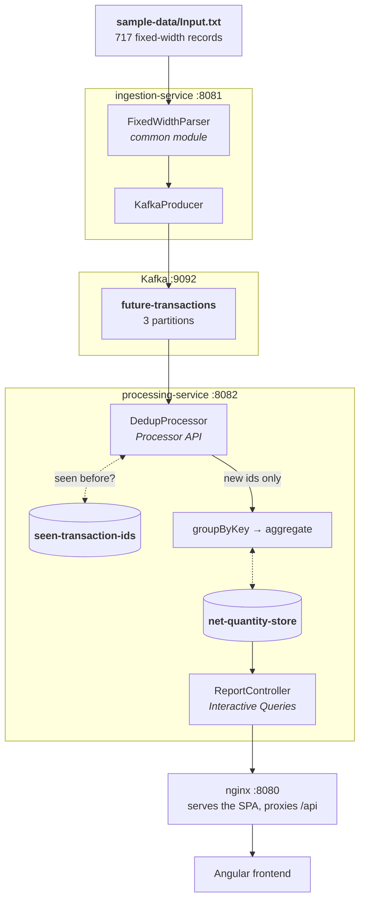

# Architecture

How the pipeline fits together. For *why* it is built this way, see
[design notes](design-notes.md). For the reviewer's overview and how to run it, see
the [README](../README.md).

## The pipeline



The producer runs with `acks=all` and `enable.idempotence=true`. Each record is
published as a JSON `FutureTransaction` value, keyed by `ReportKey.encode()`, carrying
a `transactionId` header. Both state stores are persistent key-value stores, backed by
changelog topics.

## The message key

**The message key is the eight-field `ReportKey`, not the two report columns.**
`Client_Information` and `Product_Information` are *derived* from those eight fields
rather than stored, because the parser trims each field before concatenating —
which makes the sub-field boundaries variable-width and impossible to recover from
the joined string. Keying on the full `ReportKey` means every record for a given
(client, product) pair lands on the same partition, so aggregation is partition-local
with no repartition step.

The key is the eight fields, pipe-delimited:

```
clientType | clientNumber | accountNumber | subaccountNumber
| exchangeCode | productGroupCode | symbol | expirationDate
```

## Transaction ids

**The `transactionId` header is content-derived**, `sha256(fileContentHash + ":" + lineNumber)`,
so re-ingesting the same file produces the same ids, `DedupProcessor` recognises them
in `seen-transaction-ids`, and the totals do not double. This is what makes ingestion
safely repeatable — and it is also what makes a *different* file add to the totals
rather than replace them (see the [caveat](../README.md#using-your-own-file)).

## State stores

`seen-transaction-ids` holds every `transactionId` the pipeline has processed;
`DedupProcessor` consults it before passing a record on. `net-quantity-store` holds the
running per-(client, product) aggregate that `ReportController` serves via Interactive
Queries. Both are persistent and changelog-backed, so an instance rebuilds its state
after a restart rather than recomputing it from the source topic.

## Startup ordering

Kafka Streams validates its topology against the source topic at startup, so
`processing-service` cannot start before the `future-transactions` topic exists. Under
Docker Compose a one-shot `wait-for-topic` container polls until the topic is there and
then exits 0. In Kubernetes the same gate is an `initContainer` on the
`processing-service` pod (`../k8s/processing-service.yaml`).

Why the gate exists rather than an application-code retry loop:
[design notes](design-notes.md#why-the-startup-gate-exists).
