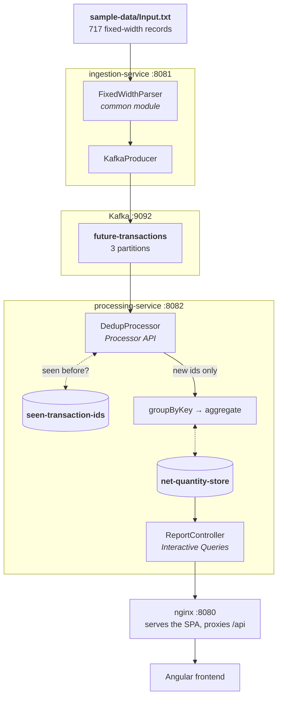

# README Simplification Implementation Plan

> **For agentic workers:** REQUIRED SUB-SKILL: Use superpowers:subagent-driven-development (recommended) or superpowers:executing-plans to implement this plan task-by-task. Steps use checkbox (`- [ ]`) syntax for tracking.

**Goal:** Split the 358-line root README into three documents — README (what it is, how to run it), `docs/architecture.md` (how it is put together), `docs/design-notes.md` (why it is like that) — and replace the two current diagrams with one simple six-node flow.

**On the length target:** the spec estimated ~130 lines for the new README. Summing the sections it actually keeps — Quick start alone is ~50 lines of commands and cold-start notes, Testing is 24 — the honest figure is **~200 lines**, a 44% cut rather than 64%. The gap is estimation error in the spec, not extra content: every section in the README below is one the spec explicitly keeps. Do not trim further to chase 130. If the reviewer wants a shorter README than this, that is a new content decision (the candidates are the cold-start block and the Testing section), not something to resolve mid-implementation.

**Architecture:** Documentation only. No application code, no build files, no manifests, no tests. Content is *relocated*, not rewritten: every paragraph in the two new docs is lifted verbatim from the current README, with only headings and link paths adjusted. The README is then rebuilt from what remains.

**Tech Stack:** Markdown, GitHub-flavoured. Mermaid diagrams (GitHub renders them natively). GitHub `[!IMPORTANT]` alert syntax.

## Global Constraints

- **Source of truth for moved text is `README.md` at commit `aeae0eb`.** Retrieve it with `git show aeae0eb:README.md`. All line numbers in this plan refer to that revision. Do not paraphrase moved text — copy it byte-for-byte except where a step explicitly says to change a link or a heading.
- **No new prose.** If a claim is not already in `README.md@aeae0eb`, it does not go in either new doc. The one exception is section headings and the connective one-liners this plan quotes literally.
- **No dangling links.** Every markdown link in all three files must resolve — file paths against the working tree, `#anchors` against headings that actually exist in the target file.
- **Relative paths shift when text moves into `docs/`.** In `docs/architecture.md` and `docs/design-notes.md`: `docs/file-spec.md` → `file-spec.md`; `docs/superpowers/specs/X` → `superpowers/specs/X`; `common/…`, `processing-service/…`, `sample-data/…`, `sample-output/…` → `../common/…`, `../processing-service/…`, `../sample-data/…`, `../sample-output/…`.
- **Drop the `CLAUDE.md` pointer.** Line 358 of the current README references a file that does not exist in this repo. It is not carried into any of the three documents.
- **No "why streaming, not batch" section.** No such rationale exists in the README or any spec, and the no-new-prose rule forbids inventing it. The assertion stays where it is, in the README's architecture intro line.
- Commit after each task. Conventional Commits, `docs:` type.

---

### Task 1: Create `docs/architecture.md`

**Files:**
- Create: `docs/architecture.md`
- Read-only source: `README.md` @ `aeae0eb` (lines 26–74, 116–117)

**Interfaces:**
- Produces: the anchors `#the-pipeline`, `#the-message-key`, `#transaction-ids`, `#state-stores`, `#startup-ordering`. Task 3 links to this file; Task 4 verifies these anchors resolve.

- [ ] **Step 1: Extract the source text**

Run this and keep the output visible while writing the file:

```bash
git show aeae0eb:README.md | sed -n '26,74p;116,117p'
```

- [ ] **Step 2: Write `docs/architecture.md`**

Create the file with exactly this structure. Text marked *(moved: lines N–M)* is copied verbatim from the extract in Step 1, with the relative-path shifts from Global Constraints applied.

````markdown
# Architecture

How the pipeline fits together. For *why* it is built this way, see
[design notes](design-notes.md). For the reviewer's overview and how to run it, see
the [README](../README.md).

## The pipeline



The producer runs with `acks=all` and `enable.idempotence=true`. Each record is
published as a JSON `FutureTransaction` value, keyed by `ReportKey.encode()`, carrying
a `transactionId` header. Both state stores are persistent key-value stores, backed by
changelog topics.

## The message key

*(moved: lines 62–68 — the paragraph beginning "**The message key is the eight-field
`ReportKey`, not the two report columns.**", verbatim, including the bold lead-in.)*

The key is the eight fields, pipe-delimited:

```
clientType | clientNumber | accountNumber | subaccountNumber
| exchangeCode | productGroupCode | symbol | expirationDate
```

## Transaction ids

*(moved: lines 70–74 — the paragraph beginning "**The `transactionId` header is
content-derived**", verbatim. Change the trailing link `[caveat](#using-your-own-file)`
to `[caveat](../README.md#using-your-own-file)`.)*

## State stores

`seen-transaction-ids` holds every `transactionId` the pipeline has processed;
`DedupProcessor` consults it before passing a record on. `net-quantity-store` holds the
running per-(client, product) aggregate that `ReportController` serves via Interactive
Queries. Both are persistent and changelog-backed, so an instance rebuilds its state
after a restart rather than recomputing it from the source topic.

## Startup ordering

Kafka Streams validates its topology against the source topic at startup, so
`processing-service` cannot start before the `future-transactions` topic exists. Under
Docker Compose a one-shot `wait-for-topic` container polls until the topic is there and
then exits 0. *(moved: lines 116–117 — "In Kubernetes the same gate is an
`initContainer` on the `processing-service` pod (`k8s/processing-service.yaml`)." Change
the path reference to `../k8s/processing-service.yaml`.)*

Why the gate exists rather than an application-code retry loop:
[design notes](design-notes.md#why-the-startup-gate-exists).
````

Note the two paragraphs written fresh here — the producer/store summary under the
diagram, and the `state stores` paragraph — are not new claims. They restate facts that
were inside diagram node labels at lines 34, 38, 43 and 45 of the source, which is where
they lived before the diagram was trimmed.

- [ ] **Step 3: Verify the mermaid parses and every link resolves**

```bash
cd /Users/shaurya/Documents/Dev/processed-future-movement
grep -c '```mermaid' docs/architecture.md   # expect 1
grep -o ']([^)#][^)]*)' docs/architecture.md | tr -d ']()' | \
  while read -r p; do [ -e "docs/$p" ] || echo "BROKEN: $p"; done
```

Expected: `1`, and no `BROKEN:` lines.

- [ ] **Step 4: Confirm no text was lost**

Each of these must appear in `docs/architecture.md`:

```bash
grep -c "eight-field" docs/architecture.md          # expect 1
grep -c "sha256" docs/architecture.md               # expect 1
grep -c "seen-transaction-ids" docs/architecture.md # expect >= 2
grep -c "net-quantity-store" docs/architecture.md   # expect >= 2
grep -c "initContainer" docs/architecture.md        # expect 1
```

- [ ] **Step 5: Commit**

```bash
git add docs/architecture.md
git commit -m "docs(architecture): add architecture doc with the detailed diagram

Moves the detailed pipeline diagram out of the README and trims it: the
key encoding, producer config and store properties come out of the node
labels and become prose beneath it."
```

---

### Task 2: Create `docs/design-notes.md`

**Files:**
- Create: `docs/design-notes.md`
- Read-only source: `README.md` @ `aeae0eb` (lines 111–115, 177–178, 184–207, 209–242, 257–263, 310–326, 340–356)

**Interfaces:**
- Consumes: `docs/architecture.md` from Task 1 — link to it as `architecture.md`.
- Produces: the anchors `#why-ingestion-is-rest-triggered`, `#why-the-startup-gate-exists`, `#why-503-and-not-an-empty-200`, `#csv-vs-json-a-deliberate-divergence`, `#assumptions-in-depth`, `#scalability`, `#the-per-slice-design-docs`. Tasks 1 and 3 link to `#why-the-startup-gate-exists`, `#scalability`, `#assumptions-in-depth` and `#csv-vs-json-a-deliberate-divergence`; Task 4 verifies all of them.

- [ ] **Step 1: Extract the source text**

```bash
git show aeae0eb:README.md | sed -n '111,115p;177,178p;184,207p;209,242p;257,263p;310,326p;340,356p'
```

- [ ] **Step 2: Write `docs/design-notes.md`**

Create the file with exactly this structure. Every *(moved: …)* block is verbatim from
the Step 1 extract, with the relative-path shifts from Global Constraints applied.

````markdown
# Design notes

Why the system looks the way it does. For how it fits together, see
[architecture](architecture.md). For the overview and how to run it, see the
[README](../README.md).

## Why ingestion is REST-triggered

*(moved: lines 184–197 verbatim — the whole subsection body, from "System A writes its
file…" through "…which the full-pipeline golden test depends on.", including the
two-bullet list of rejected alternatives. Rewrite the spec link on line 188 from
`docs/superpowers/specs/2026-08-09-ingestion-service-design.md` to
`superpowers/specs/2026-08-09-ingestion-service-design.md`.)*

## Why the startup gate exists

*(moved: lines 111–115 verbatim — the paragraph from "Kafka Streams validates its
topology at startup." through "…without an application-code retry loop that would only
paper over it." Drop the bold "**Why the gate exists.**" lead-in, since it is now the
heading. The trailing sentence about the Kubernetes `initContainer` stays in
[architecture](architecture.md#startup-ordering) and is not repeated here.)*

## Why `503` and not an empty `200`

*(moved: lines 257–263 verbatim — the paragraph from "Between process start and the
Kafka Streams store…" through "…keeps the last good data on a failed refresh for the
same reason." Drop the bold "**Why `503` and not an empty `200`.**" lead-in, since it is
now the heading.)*

## CSV vs JSON: a deliberate divergence

*(moved: lines 312–326 verbatim — the three paragraphs beginning "`Output.csv` carries
**exactly the three required columns**". Rewrite the spec link from
`docs/superpowers/specs/2026-08-12-ui-tailwind-redesign-design.md` to
`superpowers/specs/2026-08-12-ui-tailwind-redesign-design.md`.)*

## Why re-ingesting a different file adds to the totals

*(moved: lines 177–178 verbatim — "This is designed behaviour — it is the same property
that makes re-ingesting the *same* file a no-op — but it surprises people, so it is
worth stating plainly." Strip the leading `> ` blockquote markers; this is body text
here, not a callout. The `docker compose down -v` remedy at lines 174–175 stays in the
README and is **not** moved.)*

The mechanism is the content-derived `transactionId`:
[architecture](architecture.md#transaction-ids). The operational warning is in the
[README](../README.md#using-your-own-file).

## Assumptions in depth

*(moved: lines 201–207 — reproduce the `Assumption | Basis` table in full and verbatim,
with the two path fixes: `docs/file-spec.md` → `file-spec.md`, and the
`See [Scalability](#scalability)` link on the last row → `[Scalability](#scalability)`,
which now resolves within this document.)*

The `D` = debit assumption is the one to watch. It is confirmed *consistent* across the
sample — all 717 records carry `D` at positions 86, 102 and 118 — but not *verified*,
because there is no `C` example anywhere in the sample, so the accounting convention is
inferred rather than observed. It became load-bearing only once fees were surfaced in
the UI; before that it affected nothing the report displayed.

## Scalability

*(moved: lines 211–242 verbatim — all three blocks: "**Current limits, and why each
exists.**", the numbered "**What would change at 100x**" list, and "**Properties the
design already has.**", plus the closing pointer to the processing-service design doc.
Rewrite that link from `docs/superpowers/specs/2026-08-09-processing-service-design.md`
to `superpowers/specs/2026-08-09-processing-service-design.md`.)*

## The per-slice design docs

*(moved: lines 342–356 verbatim — the intro sentence "Each slice was designed before it
was built…" and the full nine-row `Doc | What it decides` table at lines 346–356.
Rewrite all nine link paths from `docs/superpowers/specs/X` to
`superpowers/specs/X`.)*
````

The one paragraph written fresh — the `D` = debit expansion under **Assumptions in
depth** — restates the Basis cell at line 203 of the source and the verification note
already recorded in
[the README overhaul spec](superpowers/specs/2026-08-13-readme-overhaul-design.md). It
introduces no new claim.

- [ ] **Step 3: Verify links and anchors**

```bash
cd /Users/shaurya/Documents/Dev/processed-future-movement
grep -o ']([^)#][^)]*)' docs/design-notes.md | tr -d ']()' | \
  while read -r p; do [ -e "docs/$p" ] || echo "BROKEN FILE: $p"; done
grep -c "superpowers/specs/" docs/design-notes.md   # expect >= 11
grep -c "docs/superpowers" docs/design-notes.md     # expect 0 — paths must be relative
```

Expected: no `BROKEN FILE:` lines, `>= 11`, then `0`.

- [ ] **Step 4: Confirm all nine spec links survived**

```bash
for f in docs/superpowers/specs/2026-08-0*.md docs/superpowers/specs/2026-08-1[12]*.md; do
  b=$(basename "$f")
  grep -q "$b" docs/design-notes.md || echo "MISSING SPEC LINK: $b"
done
```

Expected: no output.

- [ ] **Step 5: Commit**

```bash
git add docs/design-notes.md
git commit -m "docs(design-notes): add design notes with the rationale moved from README

Collects the reasoning the README carried inline — the REST trigger, the
startup gate, 503 over an empty 200, the CSV/JSON divergence, assumptions
in depth and scalability — and indexes the nine per-slice specs."
```

---

### Task 3: Rewrite `README.md`

**Files:**
- Modify: `README.md` (full rewrite, 358 → ~200 lines)
- Read-only source: `README.md` @ `aeae0eb`

**Interfaces:**
- Consumes: `docs/architecture.md` (Task 1) and `docs/design-notes.md` (Task 2), including the anchors each declares.
- Produces: the anchor `#using-your-own-file`, which `docs/architecture.md` and `docs/design-notes.md` both link to. It must survive this rewrite.

- [ ] **Step 1: Write the new `README.md`**

Replace the file entirely. Sections in this order; *(kept: lines N–M)* means copy
verbatim from `git show aeae0eb:README.md`, unchanged, paths untouched (this file stays
at the repo root, so root-relative paths still resolve).

1. **Title and intro** — *(kept: lines 1–3)*

2. **`## Problem`** — *(kept: lines 5–14)*

3. **`## Architecture`** — this replacement intro line, then the diagram, then the
   module table *(kept: lines 76–82)*, then the pointer:

   ````markdown
   ## Architecture

   This is built as a real-time streaming pipeline rather than a one-shot batch job:

   ```mermaid
   flowchart LR
       FILE["Input.txt"] --> ING["ingestion-service"]
       ING --> K[("Kafka")]
       K --> PROC["processing-service"]
       PROC --> API["REST API"]
       API --> UI["Angular UI"]
   ```

   *(module table: kept lines 76–82)*

   The detailed diagram, the message key, dedup and the state stores are in
   [docs/architecture.md](docs/architecture.md).
   ````

4. **`## Quick start`** — merges the current "Application startup" and "How to use the
   application". Order: the three commands *(kept: lines 132–150, the `docker compose up`
   / `curl` / UI URL / `down -v` sequence)*, then the Maven-on-host variant *(kept: lines
   152–159, including the `k8s/README.md` link)*, then this cold-start block:

   ````markdown
   ### What happens on a cold start

   *(kept: lines 101–109 — the "Cold start is ordered, and the ordering matters:" line
   and the four numbered steps.)*

   *(kept: lines 119–128 — the `Exited (0)` note, the "The wait loop has no timeout"
   paragraph, and the `docker compose logs wait-for-topic` block.)*

   Why the gate exists rather than an application-code retry:
   [design notes](docs/design-notes.md#why-the-startup-gate-exists).
   ````

5. **`### Using your own file`** — *(kept: lines 163–164)*, then the `[!IMPORTANT]`
   callout trimmed to its first three blocks *(kept: lines 166–175)* — the bold
   one-liner, the "A different file produces different…" paragraph, and the
   `docker compose down -v` paragraph. **Drop lines 177–178** (the "This is designed
   behaviour…" paragraph), which moved to design notes in Task 2. Close the callout with:

   ```markdown
   > Why this is designed behaviour, and not a bug:
   > [design notes](docs/design-notes.md#why-re-ingesting-a-different-file-adds-to-the-totals).
   ```

   The heading text must stay exactly `### Using your own file` so the
   `#using-your-own-file` anchor still resolves.

6. **`## Assumptions`** — the table *(kept: lines 201–207)*, with the last row's
   `See [Scalability](#scalability)` rewritten to
   `See [Scalability](docs/design-notes.md#scalability)`. Follow the table with:

   ```markdown
   Why each assumption is safe, and what breaks if `D` = debit is wrong:
   [design notes](docs/design-notes.md#assumptions-in-depth).
   ```

7. **`## API endpoints`** — the table and nginx note *(kept: lines 246–255)*, then the
   `Content-Disposition` paragraph *(kept: lines 265–266)*, then:

   ```markdown
   Why the API returns `503` rather than an empty `200`, and why the CSV and JSON
   payloads differ: [design notes](docs/design-notes.md#why-503-and-not-an-empty-200).
   ```

   **Drop lines 257–263** (the `503` rationale), moved in Task 2.

8. **`## Requirements traceability`** — *(kept: lines 86–97)*, unchanged.

9. **`## Testing`** — *(kept: lines 285–308)*, unchanged. The whole section stays: the
   two commands, the `FullPipelineGoldenTest` paragraph, the `CsvFixtureDriftTest`
   paragraph and the "Beyond that:" paragraph. It is 24 lines of fact about what the
   tests actually assert, with no rationale to relocate, and no other task picks this
   content up.

10. **`## Tech stack`** — *(kept: lines 270–281)*, unchanged.

11. **`## Known limitations`** — *(kept: lines 330–338)*, with the last row's
    `see [Scalability](#scalability)` rewritten to
    `see [design notes](docs/design-notes.md#scalability)`.

12. **`## Further reading`** — new section, replacing the old "Design decisions" table
    and the `CLAUDE.md` line:

    ```markdown
    ## Further reading

    | Doc | What it covers |
    |---|---|
    | [Architecture](docs/architecture.md) | The detailed diagram, the message key, dedup, the state stores, startup ordering |
    | [Design notes](docs/design-notes.md) | Why it is built this way — rationale, assumptions in depth, scalability, and the nine per-slice design docs |
    | [File spec](docs/file-spec.md) | The fixed-width record layout |

    Per-module detail: [`common`](common/) · [`ingestion-service`](ingestion-service/) ·
    [`processing-service`](processing-service/) · [`frontend`](frontend/) ·
    [`k8s`](k8s/README.md)
    ```

- [ ] **Step 2: Check the length landed in range**

```bash
wc -l README.md
```

Expected: between 180 and 220. If it is over 220, the likeliest cause is a rationale
paragraph that should have been dropped — re-check items 5 and 7 above, which are the
two places rationale sat adjacent to content that stays. If it is under 180, something
that should have been kept was dropped; check items 8, 9 and 10, which are verbatim
carry-overs.

- [ ] **Step 3: Confirm the removed sections are gone**

```bash
cd /Users/shaurya/Documents/Dev/processed-future-movement
for s in "## Scalability" "CSV vs JSON" "## Design decisions" "Assumptions and design rationale" "CLAUDE.md" "Why the gate exists" "Why \`503\`"; do
  grep -q "$s" README.md && echo "STILL PRESENT: $s"
done
```

Expected: no output.

- [ ] **Step 4: Confirm the kept sections survived**

```bash
for s in "## Problem" "## Architecture" "## Quick start" "### Using your own file" \
         "## Assumptions" "## API endpoints" "## Requirements traceability" \
         "## Testing" "## Tech stack" "## Known limitations" "## Further reading"; do
  grep -q "$s" README.md || echo "MISSING: $s"
done
grep -c '```mermaid' README.md   # expect 1
```

Expected: no `MISSING:` lines, then `1`.

- [ ] **Step 5: Commit**

```bash
git add README.md
git commit -m "docs(readme): cut to orientation and operation

Drops the inline rationale — scalability, the CSV/JSON divergence, the
503 reasoning, the REST-trigger argument — in favour of links into
docs/design-notes.md, and replaces both diagrams with one six-node flow.
358 lines to ~130."
```

---

### Task 4: Verify every link across all three documents

**Files:**
- Create: `/private/tmp/claude-501/-Users-shaurya-Documents-Dev-processed-future-movement/cf2c9b0f-a305-42fe-aeeb-892010465b2d/scratchpad/check-links.sh` (throwaway, not committed)
- Read-only: `README.md`, `docs/architecture.md`, `docs/design-notes.md`

**Interfaces:**
- Consumes: all three documents, and every anchor declared by Tasks 1–3.

- [ ] **Step 1: Write the link checker**

This resolves both file targets and `#anchors`, accounting for each file's own
directory. Anchor matching follows GitHub's slug rules: lowercase, drop anything that
is not alphanumeric/space/hyphen, spaces to hyphens.

```bash
cat > "$SCRATCH/check-links.sh" <<'SH'
#!/usr/bin/env bash
# Verify every markdown link in the three top-level docs resolves.
set -u
cd "$(git rev-parse --show-toplevel)" || exit 1
fail=0

slugs() {  # emit the GitHub anchor slug for every ATX heading in $1
  grep -E '^#{1,6} ' "$1" | sed -E 's/^#+ //' \
    | tr '[:upper:]' '[:lower:]' \
    | sed -E 's/`//g; s/[^a-z0-9 -]//g; s/ +/-/g'
}

for src in README.md docs/architecture.md docs/design-notes.md; do
  dir=$(dirname "$src")
  # every ( ... ) target of a markdown link, excluding bare http(s)
  grep -o '](\([^)]*\))' "$src" | sed -E 's/^\]\(//; s/\)$//' \
    | grep -v '^https\?://' | while read -r target; do
      path="${target%%#*}"
      anchor="${target#*#}"
      [ "$anchor" = "$target" ] && anchor=""

      if [ -n "$path" ]; then
        resolved="$dir/$path"
        if [ ! -e "$resolved" ]; then
          echo "BROKEN PATH  $src -> $target"; fail=1; continue
        fi
        target_file="$resolved"
        [ -d "$resolved" ] && target_file="$resolved/README.md"
      else
        target_file="$src"
      fi

      if [ -n "$anchor" ] && [ -f "$target_file" ]; then
        if ! slugs "$target_file" | grep -qx "$anchor"; then
          echo "BROKEN ANCHOR  $src -> $target"; fail=1
        fi
      fi
    done
done
exit $fail
SH
chmod +x "$SCRATCH/check-links.sh"
```

Set `SCRATCH` first:

```bash
export SCRATCH=/private/tmp/claude-501/-Users-shaurya-Documents-Dev-processed-future-movement/cf2c9b0f-a305-42fe-aeeb-892010465b2d/scratchpad
```

- [ ] **Step 2: Run it**

```bash
"$SCRATCH/check-links.sh"
```

Expected: no output. Any `BROKEN PATH` or `BROKEN ANCHOR` line names the source file and
the exact target — fix it in the offending document and re-run until clean.

Note that `[`common`](common/)` and the other per-module links resolve to directories;
the checker treats a directory as valid and looks for `README.md` inside it only when an
anchor is present. `common/`, `ingestion-service/`, `processing-service/` and `frontend/`
all contain a `README.md`; `k8s` is linked as `k8s/README.md` directly.

- [ ] **Step 3: Confirm nothing was lost in the split**

Every distinctive phrase from a removed README section must now exist somewhere:

```bash
cd "$(git rev-parse --show-toplevel)"
for phrase in "CommandLineRunner" "directory watcher" "MissingSourceTopicException" \
              "Async batched sends" "Streaming parse" "Partition sizing" \
              "cross-instance query routing" "genuinely zero rows" \
              "gross long, gross short" "eight-field" "sha256" \
              "CsvFixtureDriftTest"; do
  grep -rqF "$phrase" README.md docs/architecture.md docs/design-notes.md \
    || echo "LOST: $phrase"
done
```

Expected: no output. Each phrase has exactly one correct home: `CommandLineRunner`,
`directory watcher`, `MissingSourceTopicException`, the three 100x list items,
`cross-instance query routing`, `genuinely zero rows` and `gross long, gross short` in
`docs/design-notes.md`; `eight-field` and `sha256` in `docs/architecture.md`;
`CsvFixtureDriftTest` in the README's Testing section, which Task 3 keeps intact.

- [ ] **Step 4: Read all three documents end to end**

Open `README.md`, `docs/architecture.md` and `docs/design-notes.md` and read them in
that order, as a reviewer would. Check for: a section that now opens mid-thought because
its lead-in stayed behind; a "see below" or "above" that no longer points at anything;
duplicated paragraphs that landed in two documents.

- [ ] **Step 5: Commit any fixes**

```bash
git add -A README.md docs/
git commit -m "docs: fix link targets and continuity after the README split"
```

Skip this step if Steps 2–4 produced no changes.

---

## Done when

- `README.md` is between 180 and 220 lines and contains exactly one mermaid diagram.
- `docs/architecture.md` and `docs/design-notes.md` exist and are committed.
- The link checker exits clean across all three.
- No phrase from the "nothing was lost" list is missing.
- `git diff main --stat` shows changes to `README.md`, `docs/architecture.md` and
  `docs/design-notes.md` only — no application code, no `docker-compose.yml`, no
  manifests, no tests.
